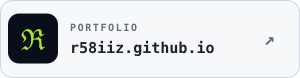
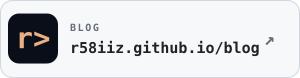

<!-- HEADER: Generated by https://github.com/kyechan99/capsule-render -->

    

 

<!-- TYPING ANIMATION: Generated by https://github.com/DenverCoder1/readme-typing-svg -->

    

 

<!-- SVG inspiration from https://github.com/DomiRosario -->

---

 

- 🌱 Currently learning binary exploitation
- 🔍 Interested in programming, systems engineering, and cybersecurity.

 

---

### Languages

 
 

### Runtime and Frameworks

<!--  -->
<!--  -->

 
 

### Infrastructure

<!--  -->

 
 

### Backend & Data

<!--  -->

 
 

### Tools

 

<!-- FOOTER: Generated by https://github.com/kyechan99/capsule-render -->

    

